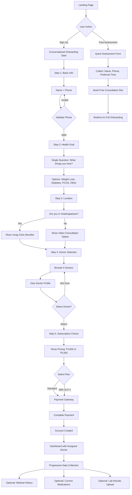
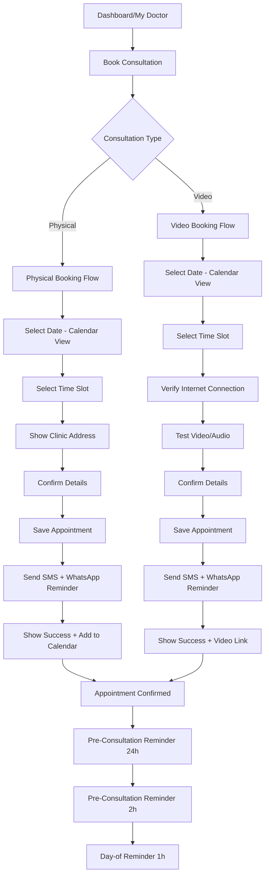
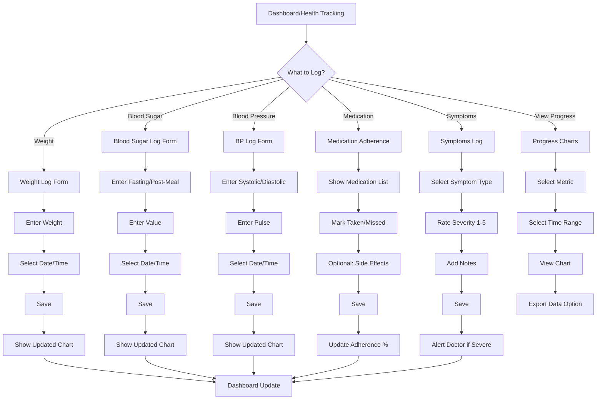

# MetaboWell UI/UX Specification

**Document Version:** 1.0  
**Date:** November 2, 2025  
**Prepared By:** Sally (UX Expert)  
**Status:** Draft for Review

---

## Introduction

This document defines the user experience goals, information architecture, user flows, and visual design specifications for MetaboWell's user interface. It serves as the foundation for visual design and frontend development, ensuring a cohesive and user-centered experience.

Based on the PRD and Project Brief, MetaboWell is India's first doctor-led metabolic health ecosystem, combining in-person endocrinologist consultations in Visakhapatnam with digital follow-up care India-wide. The platform addresses critical gaps in Indian healthcare where patients receive prescriptions but lack ongoing support, coordination, and community—especially critical for GLP-1 medications requiring long-term management.

The UI/UX must support:
- Trust-building (especially for Tier-2 users with lower digital health adoption)
- Relationship continuity (assigned doctor throughout journey)
- Progressive data collection (frictionless onboarding)
- Multi-stakeholder coordination (doctors, dieticians, labs, pharmacy)
- Long-term engagement (weight tracking, medication adherence, community support)

---

## Overall UX Goals & Principles

### Target User Personas

**Primary User: Health-Conscious Adult with Metabolic Health Concerns**
- Age: 30-55 years old
- Location: Tier-1 and Tier-2 India (starting with Visakhapatnam)
- Condition: Obesity (BMI 30+), Type-2 diabetes, PCOS, or metabolic disorders
- Prior attempts: Traditional weight loss methods unsuccessful
- Tech comfort: Moderate (somewhat familiar with apps but may be cautious with healthcare)
- Key need: Trust in medical authority, ongoing support, and feeling understood rather than judged

**Secondary User: Caregiver/Family Member**
- Supporting someone with metabolic health issues
- Needs visibility into progress and care plan
- May assist with booking and tracking

**Provider User: Endocrinologist**
- Needs efficient tools for patient management
- Values time-saving features (voice-to-text notes)
- Requires clear EHR access and communication tools

### Usability Goals

1. **Ease of learning:** New patients can complete onboarding and book their first consultation within 5 minutes (FR1 requirement)
2. **Trust establishment:** First-time users can verify doctor credentials and understand service value within 2 minutes of landing
3. **Efficiency of use:** Returning patients can log weight/blood sugar and message their doctor in <30 seconds
4. **Error prevention:** Clear validation and confirmation for medication adherence, appointment bookings, and payment actions
5. **Memorability:** Infrequent users (monthly check-ins) can navigate dashboard and track progress without relearning
6. **Accessibility:** Platform usable by users with varying tech literacy levels, supporting English + Hindi (Telugu in Phase 2)

### Design Principles

1. **Trust first, features second** — Prioritize medical credibility (doctor credentials, certifications) and transparent communication over feature density
2. **Progressive disclosure** — Start with minimal data collection, reveal complexity gradually as users engage deeper
3. **Relationship continuity** — Make the assigned doctor relationship visible and accessible throughout the journey
4. **Clarity over cleverness** — Use familiar healthcare UI patterns; avoid novelty that could confuse users unfamiliar with digital health
5. **Accessible by default** — Design for users with varying tech literacy and physical abilities from the start (WCAG 2.1 AA target)
6. **Empathy-driven messaging** — Use empowering language ("Take control of your life") rather than shaming or clinical jargon
7. **Multi-channel consistency** — Ensure WhatsApp, web, and future mobile app feel like one integrated experience

### Change Log

| Date | Version | Description | Author |
|------|---------|-------------|--------|
| 2025-11-02 | 1.0 | Initial UI/UX specification creation | Sally (UX Expert) |

---

## Information Architecture (IA)

### Site Map / Screen Inventory

```mermaid
graph TD
    A[Landing Page] --> B[Public Pages]
    A --> C[Patient Portal]
    A --> D[Provider Portal]
    
    B --> B1[Pricing Page]
    B --> B2[Educational Content Library]
    B --> B3[Free Assessment Booking]
    B --> B4[About/Doctor Credentials]
    
    C --> C1[Dashboard]
    C --> C2[Doctor Selection]
    C --> C3[Consultations]
    C --> C4[Health Tracking]
    C --> C5[Medical Records]
    C --> C6[Subscription]
    C --> C7[Settings]
    C --> C8[WhatsApp Support]
    
    C1 --> C1A[Assigned Doctor Card]
    C1 --> C1B[Upcoming Appointments]
    C1 --> C1C[Quick Stats]
    C1 --> C1D[Recent Lab Results]
    
    C2 --> C2A[Doctor Profiles Browse]
    C2 --> C2B[Doctor Profile Detail]
    
    C3 --> C3A[Physical Booking]
    C3 --> C3B[Video Booking]
    C3 --> C3C[Video Consultation Room]
    C3 --> C3D[Appointment History]
    
    C4 --> C4A[Weight Tracking]
    C4 --> C4B[Blood Sugar Log]
    C4 --> C4C[Blood Pressure Log]
    C4 --> C4D[Medication Adherence]
    C4 --> C4E[Symptoms Log]
    C4 --> C4F[Progress Charts]
    
    C5 --> C5A[Medical History]
    C5 --> C5B[Prescriptions]
    C5 --> C5C[Lab Results]
    C5 --> C5D[Doctor Notes]
    
    C6 --> C6A[Current Plan]
    C6 --> C6B[Billing History]
    C6 --> C6C[Payment Methods]
    C6 --> C6D[Upgrade/Downgrade]
    
    C7 --> C7A[Profile]
    C7 --> C7B[Notifications]
    C7 --> C7C[Consent Management]
    C7 --> C7D[Account Settings]
    
    D --> D1[Provider Dashboard]
    D --> D2[Patient List]
    D --> D3[EHR Management]
    D --> D4[Voice-to-Text Notes]
    D --> D5[Prescription Management]
    D --> D6[WhatsApp Inbox]
```

### Navigation Structure

**Primary Navigation (Patient Portal - Top Bar):**
- **Dashboard** — Central hub with assigned doctor, appointments, quick stats
- **My Doctor** — View assigned doctor profile, book consultations, message history
- **Health Tracking** — Log vitals, view progress charts, medication adherence
- **Consultations** — Book physical/video appointments, view history
- **Medical Records** — View EHR, prescriptions, lab results, doctor notes
- **Learn** — Educational content library (GLP-1 safety, PCOS, diabetes reversal)
- **Account** — Subscription, billing, settings (dropdown)

**Secondary Navigation:**
- **WhatsApp Support** — Floating action button (FAB) or persistent chat widget, accessible from any screen
- **Emergency Contact** — Quick access to assigned doctor contact (if urgent)
- **Free Assessment** — Prominent CTA on landing/empty states for non-subscribers

**Breadcrumb Strategy:**
- Use breadcrumbs for nested content (e.g., Learn > GLP-1 Safety > Article Title)
- Show: Home > Section > Subsection
- Make breadcrumbs clickable for quick navigation
- Hide breadcrumbs on top-level pages (Dashboard, Landing)

**Mobile Navigation (Responsive):**
- Hamburger menu consolidating primary navigation
- Bottom navigation bar with 5 core items: Dashboard, My Doctor, Tracking, Consultations, Account
- WhatsApp FAB remains visible in bottom-right corner

---

## User Flows

### Patient Onboarding Flow

**User Goal:** Complete initial signup and book first consultation within 5 minutes, collecting minimal required data upfront with progressive data collection as users engage.

**Entry Points:**
- Landing page CTA ("Start Your Journey" / "Book Free Assessment")
- Pricing page signup button
- Educational content article CTA
- Free assessment booking form

**Success Criteria:**
- User reaches value (doctor selection or booking) within 5 minutes (FR1 requirement)
- Onboarding completion rate 80%+ (NFR12)
- Minimal friction - conversational, not form-heavy
- Trust established through visible doctor credentials early in flow

**Flow Diagram:**

**Edge Cases & Error Handling:**
- **Phone validation fails:** Show clear error message with format example (10-digit Indian number), allow retry
- **User abandons mid-flow:** Save progress, send WhatsApp reminder with "Continue where you left off" link
- **All doctors booked:** Show waitlist option or next available dates, allow booking for future
- **Payment failure:** Clear error message, retry option, support contact (WhatsApp), don't lose progress
- **Duplicate phone number:** Detect existing account, offer "Already have an account? Sign in" option
- **Network timeout:** Auto-save progress, show offline message, resume when connection restored
- **User doesn't select doctor:** Allow "Let us assign" option, show auto-assignment based on availability
- **User skips subscription:** Allow free assessment booking without subscription, prompt subscription after consultation

**Notes:**
- Progressive disclosure: Collect only name, phone, health goal, location initially
- Trust-building: Show doctor credentials and RMP certification during selection step
- Conversational tone: Use chat-like UI with questions one at a time, not traditional form fields
- Time constraint: Each step should take <30 seconds; entire flow <5 minutes
- WhatsApp integration: After signup, automatically send welcome message with assigned doctor contact
- Mobile-first: Optimize for mobile (Tier-2 users primarily on mobile)

---

### Consultation Booking Flow (Physical or Video)

**User Goal:** Book a consultation (physical in Vizag or video follow-up) with assigned doctor, receive confirmation and reminders.

**Entry Points:**
- Dashboard "Book Consultation" CTA
- My Doctor page "Schedule Appointment" button
- Post-consultation "Book Follow-up" prompt
- WhatsApp message from doctor suggesting booking

**Success Criteria:**
- Booking completed in <2 minutes
- Clear distinction between physical (Vizag) and video options
- Calendar integration shows real-time availability
- SMS/WhatsApp reminders sent automatically (FR3)

**Flow Diagram:**

**Edge Cases & Error Handling:**
- **No available slots:** Show next available dates, offer waitlist, suggest alternative doctor
- **Selected slot booked:** Real-time update, show "This slot was just booked" message, suggest alternatives
- **Calendar sync fails:** Show manual "Add to Calendar" option with .ics file download
- **Reminder delivery failure:** Retry mechanism, show manual reminder option in dashboard
- **User cancels booking:** Confirmation dialog, cancellation policy display, allow reschedule option
- **Physical booking but user not in Vizag:** Detect location mismatch, suggest video alternative
- **Video booking but poor connectivity:** Warn user, suggest physical or reschedule option

**Notes:**
- Calendar should integrate with doctor's actual availability (real-time sync)
- Physical consultations show clinic address, directions, parking info, landmarks
- Video consultations include pre-consultation tech check (camera, microphone, internet speed)
- Reminders sent via both SMS and WhatsApp for redundancy (FR3 requirement)
- Cancellation policy clearly displayed: free cancellation >24h, charges apply <24h

---

### Health Tracking Flow

**User Goal:** Log weight, blood sugar, blood pressure, medication adherence, and symptoms, then view progress over time through charts.

**Entry Points:**
- Dashboard "Log Today's Data" quick action
- Health Tracking page main entry
- Post-consultation prompt to log vitals
- Scheduled reminder notification

**Success Criteria:**
- Logging takes <30 seconds for returning users
- Data visualization clearly shows progress trends
- Historical data easily accessible
- Medication adherence tracking supports GLP-1 therapy management

**Flow Diagram:**

**Edge Cases & Error Handling:**
- **Invalid data entry:** Real-time validation (e.g., weight 30-300 kg, blood sugar 50-500 mg/dL), show error immediately
- **Missing data for chart:** Show "Start logging to see your progress" empty state with CTA
- **Data sync failure:** Save locally, sync when connection restored, show "Syncing..." indicator
- **Severe symptom logged:** Automatically flag for doctor review, send WhatsApp alert, suggest immediate consultation
- **Medication adherence drops:** Alert if <80% adherence, suggest "Message your doctor" CTA
- **Historical data discrepancy:** Allow manual correction, show audit trail
- **Chart loading slow:** Show skeleton loader, prioritize last 30 days initially, lazy-load older data

**Notes:**
- Quick log: One-tap for frequent metrics (weight), expandable for less frequent (blood pressure)
- Smart defaults: Pre-fill with last logged value, today's date/time
- Progress celebration: Show positive trends with encouraging messages ("You're making progress!")
- Doctor visibility: Assigned doctor can see all logged data in EHR for informed consultations
- Export capability: Allow users to download their data (CSV/PDF) for personal records or external doctors

---

## Wireframes & Mockups

### Primary Design Files

**Design Tool:** To be determined (recommend Figma for collaboration and component libraries)

**Design File Structure:**
- `MetaboWell - Landing & Public Pages` — Landing page, pricing, educational content
- `MetaboWell - Patient Portal` — Dashboard, tracking, consultations, records
- `MetaboWell - Provider Portal` — Doctor dashboard, EHR management
- `MetaboWell - Design System` — Component library, tokens, patterns

**Design Handoff Approach:**
- Detailed designs in Figma with annotations for developers
- Interactive prototypes for key flows (onboarding, booking)
- Component specifications with states, variants, and responsive breakpoints
- Design tokens exported for development (colors, typography, spacing)

### Key Screen Layouts

#### Landing Page

**Purpose:** Trust-building entry point that converts visitors to signups within 2 minutes, emphasizing medical credibility and transparent value proposition.

**Key Elements:**
- **Hero Section:** Relatable imagery (person walking, empowerment message), "Take control of your life" headline, "Science-led healthcare" subheading
- **Doctor Credentials Display:** Photos, RMP certifications, experience, specializations (FR13, FR14)
- **Value Proposition:** Clear statement: "Your metabolic health partner for life—not just an app, not just a consultation, but a relationship"
- **Free Assessment CTA:** Prominent "Book Free 30-Minute Consultation" button (₹1,500 value) (FR16)
- **Transparent Pricing Preview:** Key pricing points (₹3,500/month standard, ₹6,000/month with GLP-1) with "See Full Pricing" link (FR11)
- **Trust Indicators:** DISHA compliance badge, doctor credentials, patient testimonials (if available)
- **Footer:** Links to educational content, about, contact, compliance/privacy

**Interaction Notes:**
- Primary CTA above fold (mobile and desktop)
- Smooth scroll to sections (pricing, doctors, about)
- WhatsApp FAB visible in bottom-right for immediate support
- Language switcher (English/Hindi) in header
- Mobile-optimized: single column, large touch targets, readable typography

**Design File Reference:** `Landing Page - Hero Section`, `Landing Page - Doctor Credentials`, `Landing Page - Pricing Preview`

---

#### Patient Dashboard

**Purpose:** Central hub showing assigned doctor relationship, upcoming appointments, quick health stats, and fast access to core actions.

**Key Elements:**
- **Assigned Doctor Card:** Large, prominent card showing doctor photo, name, "Your Doctor" label, quick message button, view profile link
- **Upcoming Appointments:** Next appointment card with date, time, type (physical/video), location/link, "Join Call" or "Get Directions" CTA
- **Quick Stats Widget:** Current weight, weight change (trend arrow), medication adherence %, days since last consultation
- **Recent Lab Results:** Latest lab test card with date, key metrics highlighted, "View All" link
- **Quick Actions:** Large buttons for "Log Weight", "Book Consultation", "Message Doctor", "View Progress"
- **Recent Activity Feed:** Timeline of recent actions (logged weight, consultation completed, prescription received)
- **Navigation:** Top nav bar (Dashboard, My Doctor, Tracking, Consultations, Medical Records, Learn, Account)

**Interaction Notes:**
- Assigned doctor card is primary focal point (relationship continuity principle)
- Quick actions accessible in <2 taps from any screen
- Dashboard refreshes automatically when user returns (show "Last updated X minutes ago")
- Empty states: Friendly prompts when no data exists ("Start tracking your weight to see progress here")
- Mobile: Bottom nav bar for core actions, top nav collapses to hamburger menu
- WhatsApp FAB remains visible

**Design File Reference:** `Dashboard - Desktop`, `Dashboard - Mobile`, `Dashboard - Empty States`

---

#### Conversational Onboarding Flow

**Purpose:** Frictionless, chat-like onboarding collecting minimal data initially, enabling users to reach doctor selection within 5 minutes.

**Key Elements:**
- **Chat Interface:** WhatsApp-style conversation UI with system questions and user responses
- **Progress Indicator:** Step X of 5 (e.g., "Step 2 of 5") with visual progress bar
- **Question Display:** One question at a time, large readable text, clear options (buttons or input fields)
- **Back/Edit:** Ability to go back and change previous answers
- **Skip Options:** Allow skipping optional questions with "Skip for now" option
- **Doctor Selection Screen:** Grid/list of 5 doctors with photos, names, credentials preview, "Select" buttons, "View Profile" links
- **Subscription Selection:** Clear pricing cards (₹3,500 vs ₹6,000), what's included, "Select Plan" buttons

**Interaction Notes:**
- One question per screen (mobile) or slide-in panel (desktop)
- Smooth transitions between steps (fade/slide animations)
- Input validation happens immediately (show error inline)
- Auto-save progress (user can abandon and resume)
- Trust-building elements visible throughout (doctor credentials, DISHA badge)
- Mobile-first: Full-screen questions on mobile, sidebar on desktop

**Design File Reference:** `Onboarding - Step 1 Basic Info`, `Onboarding - Step 4 Doctor Selection`, `Onboarding - Step 5 Subscription`

---

#### Health Tracking - Log Entry

**Purpose:** Quick, <30-second data entry for weight, blood sugar, blood pressure, medication adherence, and symptoms.

**Key Elements:**
- **Metric Selector:** Tabs or segmented control for Weight, Blood Sugar, BP, Medication, Symptoms
- **Input Form:** Large, accessible input fields with proper labels, units shown (kg, mg/dL, mmHg)
- **Smart Defaults:** Pre-filled with last logged value, today's date/time selected
- **Date/Time Picker:** Easy selection for historical entries (if logging past data)
- **Save Button:** Prominent "Save" CTA, with optional "Save & Log Another" for batch entry
- **Quick Log:** One-tap for frequent metrics (weight) - single input, immediate save
- **Chart Preview:** Mini chart showing recent trend above input (motivational)

**Interaction Notes:**
- Large touch targets (44x44px minimum for mobile)
- Input validation real-time (show error immediately if value out of range)
- Auto-focus on input field when screen loads
- Keyboard optimized (numeric keyboard for numbers, standard for text)
- Success feedback: Brief confirmation ("Weight logged!"), then show updated chart
- Skip option: "Skip today" allows user to defer without feeling pressured

**Design File Reference:** `Tracking - Weight Log`, `Tracking - Blood Sugar Log`, `Tracking - Medication Adherence`

---

#### Consultation Booking - Calendar Selection

**Purpose:** Intuitive appointment booking with clear distinction between physical (Vizag) and video consultations, showing real-time availability.

**Key Elements:**
- **Consultation Type Selector:** Toggle or segmented control for "Physical (Vizag Clinic)" vs "Video Consultation"
- **Calendar View:** Month view with available dates highlighted, booked dates grayed out, selected date emphasized
- **Time Slot Grid:** Available time slots displayed as buttons (e.g., "9:00 AM", "10:30 AM"), booked slots disabled
- **Doctor Info:** Show assigned doctor name and photo, with link to profile
- **Location Details (Physical):** Clinic address, directions link, parking info, landmarks
- **Tech Check (Video):** Pre-consultation test for camera, microphone, internet speed (optional but recommended)
- **Confirmation Summary:** Review date, time, type, doctor, location/link before final confirmation
- **Payment (if applicable):** Show consultation fee, payment method selection, "Confirm Booking" CTA

**Interaction Notes:**
- Calendar navigation: Swipe (mobile) or arrow buttons (desktop) to change months
- Real-time updates: If slot gets booked while user is selecting, show "Slot no longer available" message
- Time slot selection: Visual feedback when hovering/tapping, show selected state clearly
- Mobile: Calendar full-width, time slots scrollable grid below
- Desktop: Calendar and time slots side-by-side for faster selection
- Confirmation: Clear success message with next steps (reminders, calendar add, directions)

**Design File Reference:** `Booking - Calendar View`, `Booking - Physical Confirmation`, `Booking - Video Confirmation`

---

## Component Library / Design System

### Design System Approach

**Approach:** Build a custom design system tailored to MetaboWell's healthcare context, prioritizing trust, accessibility, and mobile-first responsive design. Consider leveraging an existing healthcare-focused design system (if available) or a well-established system like Material Design or Tailwind UI as a foundation, then customize for brand and healthcare-specific needs.

**Rationale:**
- Custom system ensures brand alignment and healthcare-specific patterns
- Using a foundation (Material/Tailwind) accelerates development and ensures accessibility
- Web-first approach: design tokens usable across web (MVP) and future mobile app (Phase 2)
- Component library supports outsourced development teams with clear specifications

**Key Considerations:**
- Component specifications should include all states (default, hover, active, disabled, error, loading)
- Accessibility baked in: WCAG 2.1 AA compliance, keyboard navigation, screen reader support
- Responsive breakpoints defined for mobile, tablet, desktop
- Multi-language support: components tested with English, Hindi (Telugu in Phase 2)
- Design tokens: colors, typography, spacing, shadows exported for development

### Core Components

#### Button

**Purpose:** Primary interactive element for CTAs, form submissions, and navigation actions.

**Variants:**
- **Primary:** Solid background, high contrast (e.g., "Book Consultation", "Save Weight")
- **Secondary:** Outlined style, lower emphasis (e.g., "Learn More", "View Profile")
- **Tertiary:** Text-only style, minimal emphasis (e.g., "Skip", "Cancel")
- **Link:** Text link style for inline actions (e.g., "View All", "Edit")

**States:**
- Default, Hover, Active (pressed), Disabled, Loading (with spinner), Error/Failure

**Usage Guidelines:**
- Primary buttons: maximum 1-2 per screen, reserved for primary actions
- Button labels: action-oriented ("Book Consultation" not "Submit")
- Touch targets: minimum 44x44px on mobile
- Loading states: show spinner + disabled state during async operations
- Error states: show retry option if action fails

---

#### Input Field

**Purpose:** Text, number, and date/time input for forms and data entry.

**Variants:**
- **Text Input:** Standard text entry (name, notes)
- **Number Input:** Numeric entry with validation (weight, blood sugar, BP)
- **Phone Input:** Country code + 10-digit Indian number format
- **Date/Time Picker:** Calendar-based date selection
- **Textarea:** Multi-line text entry (symptoms, medical history)

**States:**
- Default, Focus, Filled, Error (with message), Disabled, Read-only

**Usage Guidelines:**
- Labels above inputs (not placeholder-only)
- Units shown inline (kg, mg/dL, mmHg)
- Real-time validation with clear error messages
- Autocomplete/autofill supported for accessibility
- Keyboard optimized: numeric keyboard for numbers, standard for text
- Smart defaults: pre-fill with last logged value where appropriate

---

#### Card

**Purpose:** Container for grouped content (doctor profiles, appointment summaries, lab results).

**Variants:**
- **Default Card:** Standard content container with subtle shadow
- **Interactive Card:** Clickable card with hover state (doctor selection, appointment cards)
- **Stat Card:** Dashboard widget showing metrics (weight, adherence %)
- **Info Card:** Informational content with icon (educational content, tips)

**States:**
- Default, Hover (if interactive), Selected/Active, Disabled

**Usage Guidelines:**
- Use cards to group related information visually
- Interactive cards: clear visual feedback on hover/tap
- Stat cards: large numbers, trend indicators (arrows, colors)
- Consistent padding and spacing across card types
- Mobile: full-width cards, desktop: grid layouts possible

---

#### Navigation

**Purpose:** Primary and secondary navigation elements for site structure.

**Variants:**
- **Top Navigation Bar:** Desktop primary navigation (Dashboard, My Doctor, Tracking, etc.)
- **Bottom Navigation Bar:** Mobile core navigation (5 items max)
- **Hamburger Menu:** Mobile collapsed navigation
- **Breadcrumbs:** Secondary navigation for nested content
- **Tabs:** Section navigation within a page (Health Tracking metrics)

**States:**
- Default, Active/Selected, Hover, Disabled

**Usage Guidelines:**
- Top nav: persistent across authenticated pages, collapses on mobile
- Bottom nav: fixed position, always visible on mobile, shows active state
- Breadcrumbs: show for nested content (3+ levels deep)
- Tabs: use for switching between related views (Weight/Blood Sugar/BP tracking)
- Active state: clear visual indication (underline, background color, icon change)

---

#### Modal/Dialog

**Purpose:** Overlay dialogs for confirmations, important information, and focused actions.

**Variants:**
- **Confirmation Dialog:** Yes/No confirmations (cancel appointment, delete data)
- **Form Modal:** Focused form entry (quick log, booking confirmation)
- **Info Modal:** Important information display (educational content, consent forms)
- **Alert:** Success/error/warning notifications (toast-style or modal)

**States:**
- Default (open), Loading, Success, Error, Dismissed/Closed

**Usage Guidelines:**
- Use sparingly: modals interrupt flow, prefer inline forms where possible
- Clear close mechanism: X button, backdrop click, ESC key
- Focus trap: keyboard navigation stays within modal when open
- Mobile: full-screen modals, desktop: centered overlay
- Confirmation dialogs: clearly state consequences ("This will cancel your appointment")

---

#### Progress Indicator

**Purpose:** Show progress through multi-step processes (onboarding, form completion).

**Variants:**
- **Progress Bar:** Linear progress indicator (onboarding steps)
- **Step Indicator:** Numbered steps with checkmarks (onboarding, booking flow)
- **Loading Spinner:** Indeterminate progress (data loading, API calls)
- **Skeleton Loader:** Content placeholder during loading (charts, lists)

**States:**
- In Progress, Completed, Error/Stuck, Loading

**Usage Guidelines:**
- Progress bars: show percentage or step X of Y (e.g., "Step 2 of 5")
- Step indicators: show completed steps with checkmarks, current step highlighted
- Loading states: show spinner for <2 second operations, skeleton for longer
- Error states: show retry option if progress stalls
- Accessible: announce progress changes to screen readers

---

#### Badge/Status Indicator

**Purpose:** Show status, categories, or counts (appointment status, medication adherence, notifications).

**Variants:**
- **Status Badge:** Appointment status (Upcoming, Completed, Cancelled)
- **Count Badge:** Notification count, unread messages
- **Category Badge:** Content tags (GLP-1, PCOS, Diabetes)
- **Adherence Indicator:** Medication adherence percentage with color coding

**States:**
- Default, Success (green), Warning (yellow), Error (red), Info (blue)

**Usage Guidelines:**
- Color coding: green (good), yellow (caution), red (action needed)
- Status badges: use icons + text for clarity
- Count badges: show number only if >0, hide if 0
- Adherence indicators: visual + percentage (e.g., progress ring showing 85%)
- Accessible: status conveyed through text, not color alone

---

#### Chart/Data Visualization

**Purpose:** Display health metrics over time (weight trends, blood sugar, medication adherence).

**Variants:**
- **Line Chart:** Trends over time (weight, blood sugar)
- **Bar Chart:** Comparisons (monthly averages, before/after)
- **Progress Ring:** Circular progress (medication adherence %)
- **Sparkline:** Mini trend indicator (dashboard widgets)

**States:**
- Empty (no data), Loading, Loaded with Data, Error

**Usage Guidelines:**
- Charts: show time range selector (7 days, 30 days, 3 months, all time)
- Empty states: friendly message + CTA ("Start logging to see your progress")
- Color coding: consistent across charts (weight loss = green downward trend)
- Interactive: hover shows exact values, click to view detailed chart
- Accessible: provide data table alternative for screen readers
- Mobile: simplified charts, touch-friendly interactions

---

## Branding & Style Guide

### Visual Identity

**Brand Guidelines:** To be established (recommend linking to or creating a brand guidelines document)

**Brand Positioning:**
- **Science-led healthcare** — Medical credibility balanced with approachable warmth
- **Empowerment-focused** — "Take control of your life" messaging, not shaming
- **Relationship-driven** — Partnership with healthcare team, not transactional
- **Trustworthy** — Transparency, credentials, compliance badges

**Visual Style Direction:**
- Professional healthcare aesthetic with warmth (avoid clinical coldness)
- Clean, modern design prioritizing clarity over decoration
- Relatable imagery: real people, authentic moments (person walking, not stock photos)
- Balanced: medical authority + human support

---

### Color Palette

| Color Type | Hex Code | Usage |
|------------|----------|-------|
| Primary | To be determined (recommend #2563EB or #0EA5E9 - medical blue) | Primary CTAs, brand elements, key highlights |
| Secondary | To be determined (recommend #10B981 or #059669 - healthcare green) | Success states, positive health metrics, confirmations |
| Accent | To be determined (recommend #8B5CF6 or #7C3AED - supportive purple) | Supporting elements, highlights, secondary actions |
| Success | #10B981 (or secondary green) | Positive feedback, confirmations, positive health trends |
| Warning | #F59E0B (amber) | Cautions, important notices, medication reminders |
| Error | #EF4444 (red) | Errors, destructive actions, critical alerts |
| Neutral - Text Primary | #1F2937 (dark gray) | Primary text, headings |
| Neutral - Text Secondary | #6B7280 (medium gray) | Secondary text, labels, descriptions |
| Neutral - Borders | #E5E7EB (light gray) | Borders, dividers, card outlines |
| Neutral - Backgrounds | #FFFFFF (white) | Primary background, cards |
| Neutral - Background Secondary | #F9FAFB (off-white) | Alternate backgrounds, sections |

**Color Usage Guidelines:**
- **Primary Blue:** Trust, medical credibility, main actions
- **Healthcare Green:** Health, success, positive outcomes, weight loss trends
- **Accent Purple:** Support, community, secondary features
- **Neutral Grays:** Text hierarchy, backgrounds, subtle boundaries
- **Semantic Colors:** Use consistently (green = good, yellow = caution, red = action needed)

**Accessibility Considerations:**
- Text on backgrounds: minimum 4.5:1 contrast ratio (WCAG AA)
- Interactive elements: minimum 3:1 contrast ratio
- Color-blind friendly: don't rely solely on color (use icons, text, patterns)

---

### Typography

#### Font Families

- **Primary:** To be determined (recommend Inter, Roboto, or system font stack for performance)
- **Secondary:** To be determined (same as primary, or complementary sans-serif)
- **Monospace:** To be determined (recommend 'Courier New', 'Monaco', or system monospace for code/data)

**Font Selection Rationale:**
- **Sans-serif:** Clean, modern, readable at small sizes
- **System fonts considered:** Faster loading, familiar rendering
- **Web-safe:** Ensures consistent rendering across devices/browsers
- **Multi-language support:** Fonts support English, Hindi (Devanagari script), Telugu (Phase 2)

#### Type Scale

| Element | Size | Weight | Line Height | Usage |
|---------|------|--------|-------------|-------|
| H1 | 32px / 2rem | 700 (Bold) | 1.2 | Page titles, hero headlines |
| H2 | 24px / 1.5rem | 600 (Semi-bold) | 1.3 | Section headings, card titles |
| H3 | 20px / 1.25rem | 600 (Semi-bold) | 1.4 | Subsection headings |
| Body | 16px / 1rem | 400 (Regular) | 1.5 | Primary body text, descriptions |
| Small | 14px / 0.875rem | 400 (Regular) | 1.5 | Secondary text, labels, captions |
| Caption | 12px / 0.75rem | 400 (Regular) | 1.4 | Fine print, timestamps, metadata |

**Typography Guidelines:**
- **Headings:** Use for hierarchy, not decoration; H1 reserved for page titles
- **Body text:** 16px minimum for readability (WCAG AA)
- **Line height:** 1.5 for body text improves readability
- **Weight:** Use bold sparingly (headings, emphasis), regular for body
- **Mobile scaling:** Slightly larger on mobile (18px body) for readability

---

### Iconography

**Icon Library:** To be determined (recommend Material Icons, Heroicons, or custom healthcare icon set)

**Icon Style:**
- **Style:** Outlined or filled (consistent across library)
- **Size:** Standard sizes (16px, 20px, 24px, 32px)
- **Stroke width:** Consistent stroke weight (1.5-2px recommended)
- **Accessibility:** All icons have text labels or aria-labels

**Usage Guidelines:**
- **Consistency:** Use same icon library throughout application
- **Semantic meaning:** Icons support text, don't replace it
- **Healthcare-specific:** Medical icons (heart, pill, doctor, chart) used appropriately
- **Touch targets:** Icons in buttons minimum 44x44px on mobile
- **Color:** Icons inherit text color or use semantic colors (green/red/yellow)

**Common Icons Needed:**
- Navigation: Dashboard, Doctor, Tracking, Consultations, Records, Account
- Health: Weight, Blood Sugar, Blood Pressure, Medication, Symptoms, Chart
- Actions: Book, Message, Edit, Save, Cancel, View, Delete
- Status: Success, Error, Warning, Info, Loading
- Medical: Doctor, Prescription, Lab, Consultation, Video Call

---

### Spacing & Layout

#### Grid System

**Approach:** 12-column grid system for desktop, single column for mobile

**Breakpoints:**
- **Mobile:** < 768px — Single column, full-width content
- **Tablet:** 768px - 1024px — 2-column layouts possible
- **Desktop:** > 1024px — 12-column grid, max-width 1280px container

**Container Widths:**
- **Mobile:** Full width with 16px padding
- **Tablet:** Max-width 768px, centered
- **Desktop:** Max-width 1280px, centered, with side margins

#### Spacing Scale

**Spacing System:** 4px base unit (recommend 4, 8, 12, 16, 24, 32, 48, 64px)

| Size | Value | Usage |
|------|-------|-------|
| XS | 4px | Tight spacing, icon padding |
| SM | 8px | Compact spacing, small gaps |
| MD | 16px | Standard spacing, form inputs |
| LG | 24px | Section spacing, card padding |
| XL | 32px | Large gaps, section separators |
| 2XL | 48px | Major sections, page margins |
| 3XL | 64px | Hero sections, large whitespace |

**Spacing Guidelines:**
- **Consistency:** Use spacing scale throughout (no arbitrary values)
- **Grouping:** Related elements closer (16px), unrelated elements farther (32px+)
- **Mobile:** Slightly tighter spacing on mobile (12px vs 16px standard)
- **Whitespace:** Generous whitespace improves readability and trust

**Layout Patterns:**
- **Cards:** 16px padding inside cards, 16-24px gap between cards
- **Forms:** 24px gap between form fields, 16px gap between label and input
- **Navigation:** 16px horizontal padding in nav items, 8px vertical padding
- **Sections:** 48-64px vertical spacing between major sections

---

## Accessibility Requirements

### Compliance Target

**Standard:** WCAG 2.1 Level AA compliance (minimum)

**Rationale:**
- Healthcare accessibility standard ensures access for users with disabilities
- Supports older devices common in Tier-2 cities
- Legal compliance: DISHA and Digital Personal Data Protection Act require accessibility considerations
- WCAG AA balances compliance and implementation effort (AAA may be excessive for MVP)

**Compliance Scope:**
- All public-facing pages (landing, pricing, educational content)
- Patient portal (dashboard, tracking, consultations, records)
- Provider portal (doctor dashboard, EHR management)
- Video consultation interface
- Mobile responsive views

---

### Key Requirements

#### Visual

**Color Contrast Ratios:**
- **Text on backgrounds:** Minimum 4.5:1 contrast ratio for normal text, 3:1 for large text (18px+ or 14px+ bold)
- **Interactive elements:** Minimum 3:1 contrast ratio for buttons, links, form controls
- **Focus indicators:** 3:1 contrast ratio for focus outlines, 2px minimum thickness
- **Charts/graphs:** Color coding supplemented with patterns, labels, or icons (not color alone)

**Focus Indicators:**
- **Visible focus:** All interactive elements show clear focus outline (2px solid, high contrast)
- **Keyboard navigation:** All functionality accessible via keyboard (Tab, Enter, Space, Arrow keys)
- **Focus order:** Logical tab order matching visual layout
- **Skip links:** "Skip to main content" link for keyboard users to bypass navigation

**Text Sizing:**
- **Minimum font size:** 16px for body text (WCAG AA requirement)
- **Text scaling:** Content readable up to 200% zoom without horizontal scrolling
- **Responsive text:** Text scales appropriately on mobile devices (18px body recommended)
- **Readable fonts:** Clear, sans-serif fonts without decorative elements that reduce readability

#### Interaction

**Keyboard Navigation:**
- **Full keyboard access:** All interactive elements (buttons, links, forms, modals) accessible via keyboard
- **Tab order:** Logical sequential navigation matching visual flow
- **Keyboard shortcuts:** Common shortcuts (ESC to close modals, Enter to submit forms)
- **Focus trap:** Modals and dialogs trap focus within content (cannot tab outside)
- **Arrow key navigation:** Calendar, time slots, and lists navigable with arrow keys

**Screen Reader Support:**
- **Semantic HTML:** Proper use of headings (h1-h6), lists, landmarks (nav, main, aside, footer)
- **ARIA labels:** All icons, buttons, and interactive elements have descriptive aria-labels
- **Form labels:** All form inputs have associated labels (not placeholder-only)
- **Status announcements:** Dynamic content changes announced (e.g., "Appointment booked successfully")
- **Alt text:** All images have descriptive alt text (decorative images marked as decorative)
- **Landmarks:** Page structure clearly defined with ARIA landmarks

**Touch Targets:**
- **Minimum size:** All interactive elements minimum 44x44px on mobile (iOS/Android guidelines)
- **Spacing:** Adequate spacing between touch targets (8px minimum) to prevent accidental taps
- **Touch feedback:** Visual feedback on tap (button press animation, color change)
- **Gestures:** Standard gestures (tap, swipe, pinch) with alternative keyboard/mouse methods

#### Content

**Alternative Text:**
- **Images:** All meaningful images have descriptive alt text
- **Charts/graphs:** Data charts have text alternatives (data tables) or long descriptions
- **Icons:** Icons have aria-labels or accompanying text (not decorative-only)
- **Decorative images:** Marked with empty alt="" or aria-hidden="true"

**Heading Structure:**
- **Hierarchical structure:** Proper heading hierarchy (h1 → h2 → h3, no skipping levels)
- **One h1 per page:** Single h1 for page title/main heading
- **Descriptive headings:** Headings describe section content clearly
- **Navigation headings:** Navigation menus use proper heading structure

**Form Labels:**
- **Visible labels:** All form inputs have visible labels (not placeholder-only)
- **Label association:** Labels properly associated with inputs (for/id attributes or aria-labelledby)
- **Error messages:** Form errors clearly associated with inputs, announced to screen readers
- **Required fields:** Required fields clearly marked (asterisk + "required" text, not color alone)
- **Help text:** Form help text and instructions accessible to screen readers

**Language Support:**
- **Language declaration:** HTML lang attribute set (lang="en" or lang="hi")
- **Multi-language:** Language switching preserves accessibility features
- **Text direction:** Support for RTL languages if needed (Hindi, Telugu may require adjustments)

---

### Testing Strategy

**Automated Testing:**
- **Lighthouse:** Regular Lighthouse audits targeting 90+ accessibility score
- **axe DevTools:** Automated accessibility testing during development
- **Color contrast checkers:** Verify contrast ratios meet WCAG AA standards
- **HTML validators:** Ensure semantic HTML and proper ARIA usage

**Manual Testing:**
- **Keyboard-only navigation:** Test entire application using only keyboard (no mouse)
- **Screen reader testing:** Test with NVDA (Windows), VoiceOver (Mac/iOS), TalkBack (Android)
- **Zoom testing:** Test at 200% zoom to ensure content remains usable
- **Touch target testing:** Verify all interactive elements meet 44x44px minimum on mobile

**User Testing:**
- **Accessibility audit:** Include users with disabilities in usability testing (Phase 2)
- **Feedback loop:** Establish feedback mechanism for accessibility issues
- **Iterative improvement:** Address accessibility issues identified during testing

**Testing Checklist:**
- [ ] All images have alt text
- [ ] All forms have labels
- [ ] All interactive elements keyboard accessible
- [ ] Focus indicators visible on all elements
- [ ] Color contrast meets WCAG AA (4.5:1 for text)
- [ ] Page structure uses proper headings
- [ ] Screen reader announces dynamic content changes
- [ ] Modals trap focus and can be closed with ESC
- [ ] Touch targets minimum 44x44px on mobile
- [ ] Content readable at 200% zoom

---

## Responsiveness Strategy

### Breakpoints

| Breakpoint | Min Width | Max Width | Target Devices |
|------------|-----------|-----------|----------------|
| Mobile | 320px | 767px | Smartphones (iPhone SE to iPhone 14 Pro Max, Android phones), Primary target for Tier-2 users |
| Tablet | 768px | 1023px | iPad, Android tablets, small laptops, Secondary target |
| Desktop | 1024px | 1439px | Laptops, desktop monitors, Primary for Tier-1 users |
| Wide | 1440px | - | Large desktop monitors, 4K displays, Less common but supported |

**Breakpoint Rationale:**
- **Mobile-first:** MVP optimized for mobile (320px-767px) as primary Tier-2 user base
- **Tablet support:** 768px-1023px covers iPad and small laptops (important for providers)
- **Desktop:** 1024px+ supports desktop users (Tier-1, providers, clinic staff)
- **Wide:** 1440px+ ensures layout doesn't break on large monitors (max-width containers used)

**Device Considerations:**
- **Tier-2 market:** Many users on older Android phones (Android 8+), smaller screens (360px-414px common)
- **Low-end devices:** Support for slower connections, lower-end hardware
- **Provider devices:** Doctors may use tablets or desktops for EHR management

---

### Adaptation Patterns

#### Layout Changes

**Mobile (< 768px):**
- **Single column:** All content stacks vertically
- **Full-width cards:** Cards expand to full width with 16px side padding
- **Stacked navigation:** Top nav collapses to hamburger menu, bottom nav bar for core actions
- **Full-screen modals:** Modals take full screen instead of centered overlay
- **Vertical forms:** Form fields stack vertically, labels above inputs
- **Simplified dashboard:** Key widgets stack, less information density

**Tablet (768px - 1023px):**
- **Two-column layouts:** Sidebar + main content, or grid layouts where appropriate
- **Collapsible navigation:** Top nav may remain visible or use hamburger based on space
- **Centered modals:** Modals centered with max-width (not full screen)
- **Grid layouts:** Card grids use 2 columns where appropriate
- **Side-by-side forms:** Some forms can use 2-column layout for related fields

**Desktop (1024px+):**
- **Multi-column layouts:** 12-column grid system for flexible layouts
- **Persistent navigation:** Top nav always visible, full menu items
- **Sidebar layouts:** Dashboard may use sidebar navigation + main content area
- **Wider modals:** Modals can be wider (max-width 600px+), centered overlay
- **Grid layouts:** Card grids use 3-4 columns for optimal use of space
- **Horizontal forms:** Related form fields can be side-by-side

**Wide (1440px+):**
- **Max-width containers:** Content containers max-width 1280px, centered with side margins
- **Prevent over-stretching:** Avoid letting content stretch too wide (readability concerns)
- **Consistent spacing:** Maintain padding and spacing from desktop breakpoint

#### Navigation Changes

**Mobile:**
- **Hamburger menu:** Top nav collapses to hamburger icon, slide-out menu
- **Bottom navigation:** Fixed bottom nav bar with 5 core items (Dashboard, My Doctor, Tracking, Consultations, Account)
- **WhatsApp FAB:** Floating action button in bottom-right corner (always visible)
- **Breadcrumbs:** Hidden on top-level pages, shown for nested content (smaller, simplified)

**Tablet:**
- **Conditional navigation:** Top nav may remain visible or use hamburger based on screen width
- **Bottom nav optional:** May show bottom nav or rely on top nav depending on layout
- **Sidebar navigation:** Dashboard may use collapsible sidebar for secondary navigation

**Desktop:**
- **Full top navigation:** All nav items visible in top bar, no hamburger menu
- **No bottom nav:** Bottom navigation removed, all navigation in top bar
- **Dropdown menus:** Account and other dropdowns use standard dropdown pattern
- **Breadcrumbs:** Full breadcrumb navigation for nested content

#### Content Priority

**Mobile:**
- **Above-the-fold priority:** Most important content (assigned doctor, next appointment) visible without scrolling
- **Progressive disclosure:** Less critical information hidden behind "View More" or tabs
- **Simplified cards:** Cards show essential info, details accessible via tap/expand
- **Condensed text:** Summaries and excerpts preferred over full text
- **Lazy loading:** Images and heavy content load on scroll

**Tablet:**
- **Balanced priority:** More content visible above fold, still some progressive disclosure
- **Expanded cards:** Cards can show more information without expansion
- **Better media:** Larger images and videos can be displayed

**Desktop:**
- **Full content visible:** More content visible without scrolling
- **Expanded views:** Cards and widgets show full information
- **Rich media:** Larger images, videos, and interactive elements

#### Interaction Changes

**Mobile:**
- **Touch-optimized:** Large touch targets (44x44px minimum), adequate spacing
- **Swipe gestures:** Calendar navigation, card swiping, image galleries
- **Pull-to-refresh:** Refresh data by pulling down on dashboard/lists
- **Bottom sheets:** Action sheets slide up from bottom (native mobile pattern)
- **Haptic feedback:** Subtle vibration on key actions (if supported)

**Tablet:**
- **Hybrid interactions:** Touch and mouse/trackpad supported
- **Hover states:** Hover effects work for mouse/trackpad users
- **Gesture support:** Swipe gestures still work, but hover also available

**Desktop:**
- **Mouse/trackpad optimized:** Hover states, right-click context menus
- **Keyboard shortcuts:** More keyboard shortcuts available (e.g., Cmd/Ctrl+K for search)
- **Precise interactions:** Smaller click targets acceptable (but still minimum 44x44px for accessibility)
- **Multi-select:** Keyboard multi-select for lists and tables

---

## Animation & Micro-interactions

### Motion Principles

**Approach:** Subtle, purposeful animations that enhance usability and provide feedback without distraction. Healthcare context requires professionalism—animations should feel calm and trustworthy, not playful or distracting.

**Core Principles:**
1. **Purposeful motion** — Every animation serves a function (feedback, orientation, guidance)
2. **Performance-first** — Animations must be smooth (60fps) and not impede functionality
3. **Accessibility-aware** — Respect `prefers-reduced-motion` media query, allow disabling animations
4. **Contextual timing** — Faster for micro-interactions (100-200ms), slower for transitions (200-300ms)
5. **Easing consistency** — Use consistent easing functions (ease-out for entrances, ease-in-out for transitions)
6. **Subtle and professional** — Avoid bouncy, playful animations; prefer smooth, linear or ease-out curves

**Healthcare-Specific Considerations:**
- **Calm and reassuring:** Animations should feel supportive, not anxious or urgent
- **Clear feedback:** Users need clear confirmation that actions were successful (especially for health data entry)
- **Loading states:** Long operations show progress (data sync, video connection) to reduce anxiety
- **Error handling:** Error animations should be noticeable but not alarming

---

### Key Animations

- **Button Press:** Visual feedback on button tap/click (Duration: 100ms, Easing: ease-out) — Subtle scale down (0.98) or background color change to confirm interaction
- **Form Input Focus:** Input field highlight on focus (Duration: 150ms, Easing: ease-out) — Border color transition, subtle background change
- **Page Transitions:** Smooth navigation between pages (Duration: 200ms, Easing: ease-in-out) — Fade or slide transitions, maintain context
- **Modal Open/Close:** Modal appearance and dismissal (Duration: 250ms, Easing: ease-out) — Fade + scale or slide up from bottom (mobile), fade + scale (desktop)
- **Card Hover (Desktop):** Subtle elevation on hover (Duration: 200ms, Easing: ease-out) — Shadow increase, slight scale (1.02), provides affordance
- **Loading Spinner:** Indeterminate loading indicator (Duration: 1000ms loop, Easing: linear) — Smooth rotation, non-distracting
- **Success Feedback:** Confirmation after successful action (Duration: 300ms, Easing: ease-out) — Checkmark animation, brief color flash (green), auto-dismiss
- **Error Alert:** Error message appearance (Duration: 200ms, Easing: ease-out) — Slide down + fade in, shake for critical errors (optional)
- **Progress Bar:** Linear progress indicator (Duration: varies, Easing: linear) — Smooth fill animation, percentage updates
- **Chart Loading:** Data visualization loading state (Duration: 400ms, Easing: ease-out) — Skeleton loader or shimmer effect, then fade in
- **Dropdown Menu:** Menu open/close (Duration: 150ms, Easing: ease-out) — Fade + slide down, smooth transition
- **Calendar Navigation:** Month/year changes (Duration: 200ms, Easing: ease-in-out) — Slide left/right or fade transition
- **Weight Log Success:** Confirmation after logging weight (Duration: 400ms, Easing: ease-out) — Brief celebration animation (subtle), chart update with smooth transition
- **WhatsApp FAB Pulse:** Attention indicator for new messages (Duration: 1500ms loop, Easing: ease-in-out) — Subtle pulse effect, non-intrusive
- **Pull-to-Refresh:** Refresh gesture feedback (Duration: 300ms, Easing: ease-out) — Smooth pull animation, release triggers refresh
- **Swipe Gesture:** Card swipe feedback (Duration: 200ms, Easing: ease-out) — Follows finger, smooth return or dismiss

---

## Performance Considerations

### Performance Goals

- **Page Load:** Initial page load <3 seconds on 3G connection (NFR1 requirement), <1 second on 4G/WiFi
- **Interaction Response:** Button clicks, form submissions respond within 100ms, visual feedback immediate
- **Animation FPS:** All animations maintain 60fps, no jank or stuttering
- **Video Consultation Latency:** <200ms latency for video calls (NFR1 requirement)
- **Data Sync:** Health data logging syncs within 2 seconds, offline support with background sync
- **Chart Rendering:** Health charts load and render within 1 second for 30-day data view

**Performance Metrics:**
- **Lighthouse Performance Score:** Target 90+ (mobile and desktop)
- **First Contentful Paint (FCP):** <1.8 seconds
- **Largest Contentful Paint (LCP):** <2.5 seconds
- **Time to Interactive (TTI):** <3.5 seconds
- **Cumulative Layout Shift (CLS):** <0.1 (minimal layout shifts)
- **First Input Delay (FID):** <100ms

---

### Design Strategies

**Image Optimization:**
- **Lazy loading:** Images below fold load on scroll, reduce initial page weight
- **Responsive images:** Serve appropriately sized images based on device (srcset, sizes attributes)
- **Format optimization:** Use WebP with fallback to JPEG/PNG, compress images (80-85% quality)
- **Doctor photos:** Optimize doctor profile images (max 200KB per image, 400x400px)
- **Hero images:** Prioritize above-fold hero images, optimize heavily (max 300KB)

**Code Optimization:**
- **Code splitting:** Route-based code splitting, load only necessary JavaScript per page
- **Tree shaking:** Remove unused code from bundles
- **Minification:** Minify CSS and JavaScript for production
- **Critical CSS:** Inline critical CSS for above-fold content, defer non-critical CSS
- **Bundle size:** Target <200KB initial JavaScript bundle (gzipped)

**Loading Strategies:**
- **Skeleton loaders:** Show skeleton screens during data loading (better perceived performance)
- **Progressive enhancement:** Core functionality works without JavaScript, enhance with JS
- **Prefetching:** Prefetch likely next pages (e.g., prefetch dashboard after login)
- **Service workers:** Implement service worker for offline support and caching

**Data Fetching:**
- **Pagination:** Paginate long lists (appointment history, lab results) instead of loading all at once
- **Incremental loading:** Load dashboard widgets incrementally (show doctor card first, then stats)
- **Caching:** Cache static content (doctor profiles, educational content) aggressively
- **Optimistic updates:** Update UI immediately for user actions (log weight), sync in background

**Mobile-Specific Optimizations:**
- **Lower-end device support:** Test on Android 8+ devices, optimize for slower processors
- **Network-aware:** Detect slow connections (3G), reduce data usage (lower quality images)
- **Battery awareness:** Minimize background processes, reduce animation complexity on low battery
- **Touch optimization:** Ensure touch interactions feel immediate, no lag on tap

**Video Consultation Performance:**
- **Pre-connection check:** Test internet speed before video call, warn if insufficient
- **Quality adaptation:** Adjust video quality based on connection speed
- **Connection indicators:** Show connection quality indicator during call
- **Fallback options:** Offer audio-only option if video fails

**Chart/Data Visualization Performance:**
- **Data sampling:** Sample data points for long time ranges (e.g., show weekly averages for 1-year view)
- **Lazy rendering:** Render charts only when visible (intersection observer)
- **Simplified charts:** Use simpler chart types for mobile (line charts vs. complex visualizations)
- **Progressive loading:** Load last 30 days first, then load older data on demand

---

## Next Steps

### Immediate Actions

1. **Review and validate this specification** with stakeholders (Product, Engineering, Design)
2. **Establish brand guidelines** (colors, typography, logo) if not already defined
3. **Set up design tool** (Figma recommended) and create initial design files structure
4. **Create design system** with core components and design tokens
5. **Design key screens** starting with Landing Page, Dashboard, and Onboarding flow
6. **Conduct design review** with internal team and gather feedback
7. **Create interactive prototypes** for critical user flows (onboarding, booking, tracking)
8. **Prepare design handoff documentation** for development team
9. **Establish accessibility testing process** (automated + manual testing)
10. **Set up performance monitoring** (Lighthouse CI, performance budgets)

---

### Design Handoff Checklist

- [ ] All user flows documented with flow diagrams
- [ ] Component inventory complete with all states and variants
- [ ] Accessibility requirements defined and validated (WCAG 2.1 AA)
- [ ] Responsive strategy clear with breakpoints and adaptation patterns
- [ ] Brand guidelines incorporated (colors, typography, iconography)
- [ ] Performance goals established with measurable metrics
- [ ] Design tokens exported (colors, spacing, typography, shadows)
- [ ] Interactive prototypes created for key flows
- [ ] Design specifications annotated in Figma (or design tool)
- [ ] Component library documented with usage guidelines
- [ ] Responsive designs created for mobile, tablet, desktop breakpoints
- [ ] Accessibility annotations added (ARIA labels, keyboard navigation)
- [ ] Animation specifications documented with timing and easing
- [ ] Design handoff meeting scheduled with development team
- [ ] Ongoing design support process established (Slack channel, design review sessions)

---

### Recommended Next Steps by Role

**For Product:**
- Review and approve this specification
- Prioritize which screens/flows to design first (MVP scope)
- Validate user personas and usability goals with user research

**For Design:**
- Create detailed visual designs in Figma (or chosen design tool)
- Build component library and design system
- Create interactive prototypes for user testing
- Prepare design handoff materials

**For Engineering:**
- Review technical feasibility of design specifications
- Plan implementation approach (component architecture, design token integration)
- Set up development environment with design system integration
- Establish design review process during development

**For QA:**
- Review accessibility requirements and prepare testing checklist
- Review performance goals and prepare performance testing strategy
- Plan responsive testing across devices and breakpoints

---

**Document Status:** Draft for Review  
**Next Review Date:** To be determined  
**Version:** 1.0
